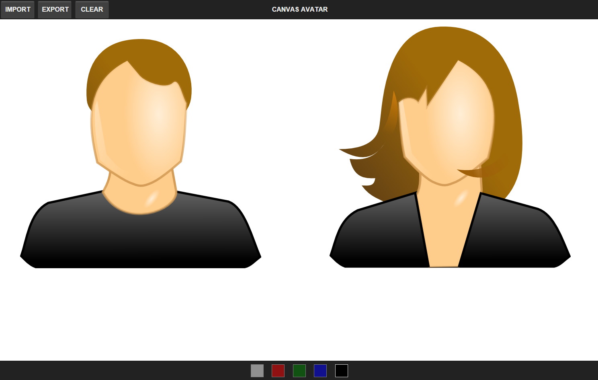

# Front-End Visualization: Canvas Avatar

> Constructing avatar application



### System requirements:
- Node.js -v 4.0.0
- NPM -v 2.14.2

### Dependencies installation:
```sh
$ npm install -g bower
$ npm install -g http-server
```

### Running application:
```sh
$ git clone [git-repo-url] canvas-avatar-painter
$ cd canvas-avatar-painter
$ bower install
$ http-server -p 3000
```
> [http://localhost:3000/](http://localhost:3000/)

### Application advantages:
- Modular file structure
- Modular code structure
- BEM layout structure
- jQuery code style
- High level UX


### Implemented features:
- Dynamic canvas creation depends on device screen resolution
- Pure CSS loader component is shown before canvas has loaded
- Drawing freestyle custom elements instead of predefined ones
- Ability to choose color for drawing elements and components
- Ability to load face template for increasing drawing speed
- Ability to download the image you create onto file system
- Ability to clear canvas without reloading active page

### Check list:
- Start the server on 3000 port and open browser
- Default color to draw on canvas is black one
- You can easily change it just tapping on pallete
- Tap on `IMPORT` button to choose male of female face prototype
- Improve the template with elements, e.g. eyes, nose, lips, etc.
- Draw your avatar and tap `EXPORT` button to download image
- Tap on `CLEAR` button to clear canvas and start drawing again